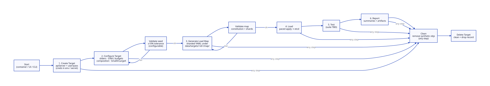

# Workflow

> **WARNING: NOT FOR USE ON ANY CLUSTER THAT IS IMPORTANT.**  
> This tool intentionally stresses etcd. Lab / Test / Dev only.

## Diagram



Source: [`diagrams/workflow.d2`](../diagrams/workflow.d2) (D2 → SVG; CI re-renders on push).

## Steps

| # | Step | What happens | Artifact |
|---|------|----------------|----------|
| 0 | **Start** | Run container / `serve` / CLI with `./data` mounted | runtime process |
| 1 | **Create Target** | Register cluster endpoint + identity. Password is **never** stored in YAML — only `OC_PASSWORD` / kubeconfig / secret ref. | `data/targets/<id>/target.yaml` |
| 2 | **Configure Target** | Edit Generation Seed: utilization, S/M/L `N × size/ns`, composition, SmallX/LargeX. **Save validates** (±10% tolerance default, configurable). | `data/targets/<id>/seed.yaml` |
| 3 | **Generate Load Map** | Materialize the full create-set as **sharded YAML** (not one giant file) so paced/parallel load can fan out safely. Map constitution is validated before success. | `data/targets/<id>/map/manifest.yaml` + `map/shards/*.yaml` |
| 4 | **Load** | Controlled apply (batch size, concurrency, pauses). Requires explicit confirm. Status polled in UI. | `data/targets/<id>/runs/load-*.json` |
| 5 | **Test** | Run suite against loaded cluster (stub until suite defined). | `runs/test-*.json` |
| 6 | **Report** | Summaries / screens for the target. | `data/targets/<id>/reports/` |
| — | **Clean** | Available **any step**: delete synthetic namespaces/objects this tool owns on the cluster. | cluster cleaned |
| — | **Delete** | Clean (if needed) + remove the Target record from runtime data. | target gone |

## Validation rules

1. **Seed (configure/save):**  
   - `sum(N × size/ns)` must be within **± tolerance** of utilization (default **10%**).  
   - Per-namespace composition must fit `size/ns`.  
   - Overshoot beyond tolerance is rejected; UI clamps where possible.

2. **Load map (generate):**  
   - Shard counts × objects must match the seed constitution (within rounding).  
   - Manifest checksums / totals must reconcile before Load is enabled.

## Layout on disk

```text
data/
  runtime.yaml
  targets/
    <target-id>/
      target.yaml          # cluster display + apiServer (no password)
      seed.yaml            # Generation Seed
      map/
        manifest.yaml      # index, totals, validation result
        shards/
          small-0000.yaml
          medium-0000.yaml
          ...
      runs/
      reports/
```

## CLI parity

```bash
etcd-synthetic-load target create  --name PROD-2 --api-server https://api...:6443
etcd-synthetic-load target configure --id <id> --seed seed.yaml
etcd-synthetic-load target generate  --id <id>
etcd-synthetic-load load-plan        --target <id> --i-understand-this-stresses-etcd
etcd-synthetic-load test             --target <id>   # stub
etcd-synthetic-load report           --target <id>
etcd-synthetic-load cleanup          --target <id>   # Clean
etcd-synthetic-load target delete    --id <id>       # Clean + drop record
```
